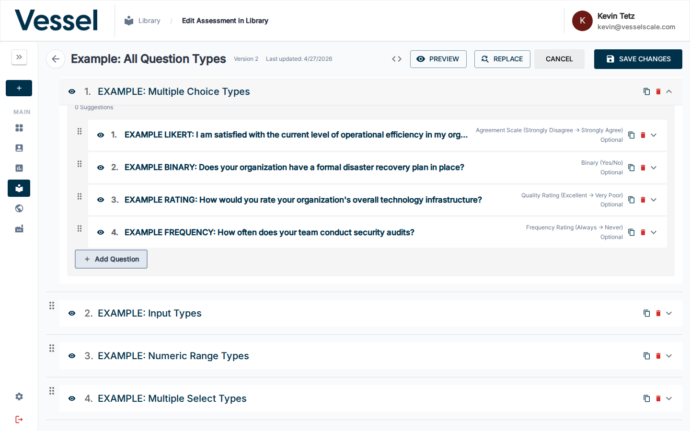
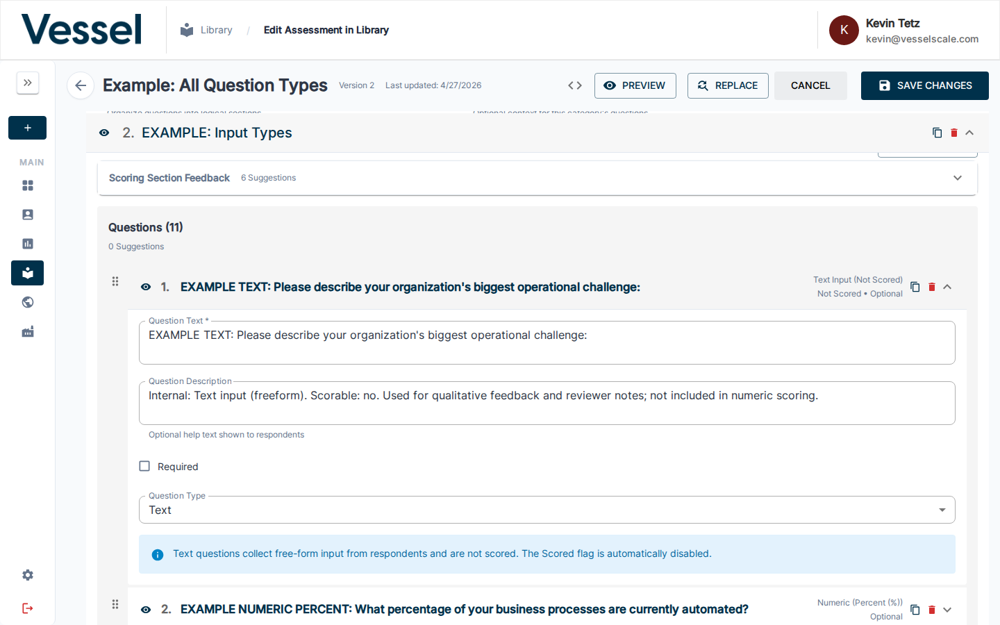
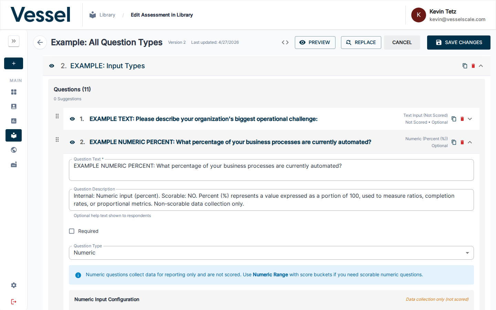
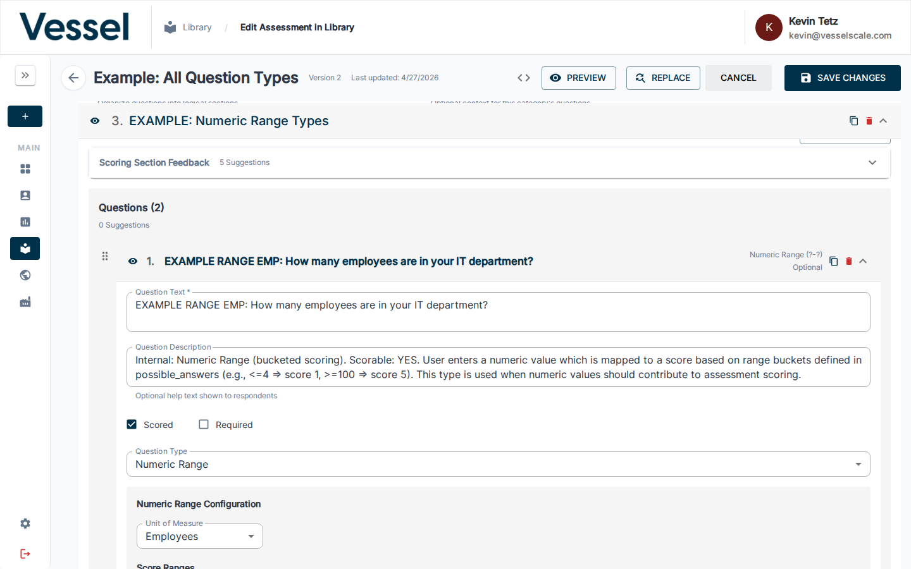
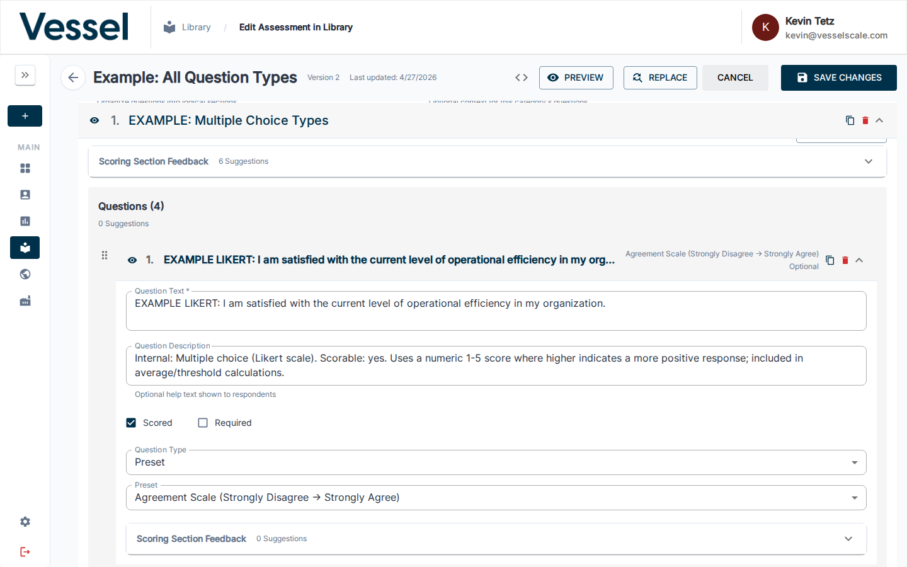
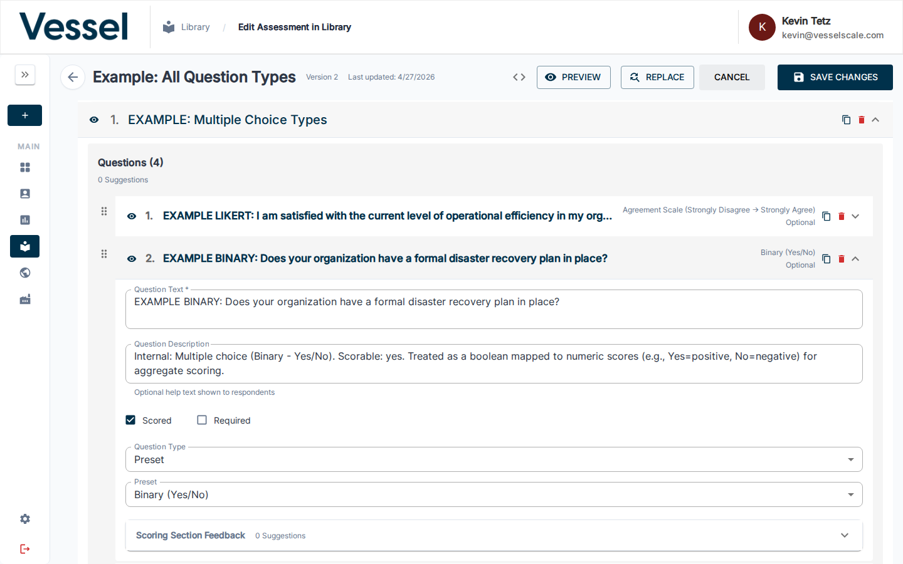
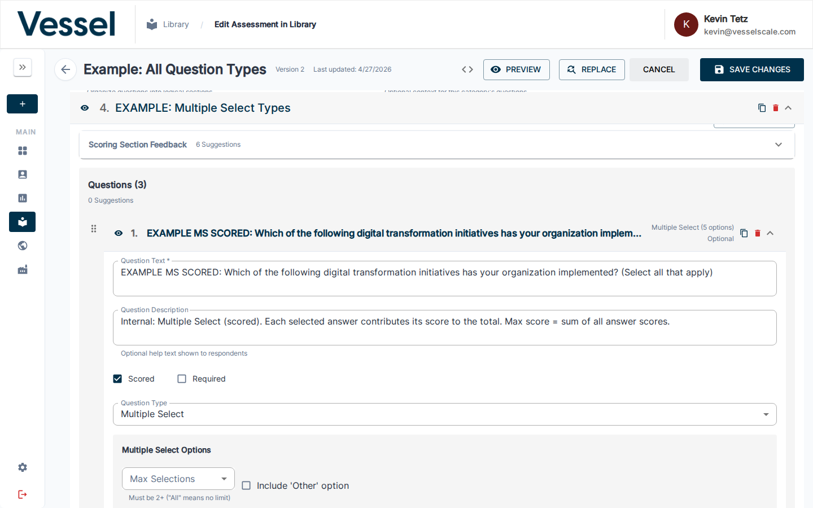

# Assessment Question Types

Assessment questions are defined by their type, which determines how respondents answer and how responses are scored. This page documents all available question types and their configuration options.

## Question Type Overview

There are five core question types available in the assessment system:

Each question type is configured in the assessment editor by clicking a question row to expand its inline editor. The **Question Type** dropdown determines which fields appear below it.



| Type | Description | Scorable | Use Case |
|------|-------------|----------|----------|
| **Text** | Open-ended text responses | No | Capturing detailed information, comments, explanations |
| **Numeric** | Single numeric value | Yes | Percentages, dollar amounts, counts, time intervals |
| **Numeric Range** | Value matched against ranges | Yes | Grouping numeric responses into score ranges |
| **Multiple Choice** | Single selection from options | Yes | Rating scales, Likert scales, yes/no questions |
| **Multiple Select** | Multiple selections allowed | Yes | Checkbox-style questions with multiple valid answers |

---

## Text

**Text Entry** questions capture open-ended responses as plain text. Respondents can write any amount of text in a free-form field.



### Parameters

| Setting | Options | Required | Default | Notes |
|---------|---------|----------|---------|-------|
| **Required** | Checkbox | No | Unchecked | Forces the respondent to provide an answer |
| **Scorable** | Checkbox | No | Unchecked | Text questions cannot be scored |

### Example Use Cases

- "Please describe your current quality management processes"
- "What challenges are you facing with supply chain management?"
- "Additional comments or observations"

### Notes

- Text responses are recorded as-is without modification
- Text questions do not have scoring rules or possible answers
- Commonly used for qualitative feedback alongside scored questions

---

## Numeric

**Numeric** questions capture a single numeric value. You can specify a unit of measure (percent, dollar amount, time interval, etc.) to provide context for the respondent.



### Parameters

| Setting | Options | Required | Default | Notes |
|---------|---------|----------|---------|-------|
| **Required** | Checkbox | No | Checked | Forces the respondent to provide an answer |
| **Scorable** | Checkbox | No | Checked | Enables automatic scoring based on the numeric value |
| **Unit of Measure** | Dropdown | No | None | Provides context for the numeric value (Percent, Dollar, Hour, etc.) |
| **Min Value** | Number | No | None | Minimum acceptable value (optional) |
| **Max Value** | Number | No | None | Maximum acceptable value (optional) |
| **Step** | Number | No | None | Increment value for numeric input (optional) |

### Supported Units of Measure

| Unit | Example |
|------|---------|
| Percent | "What percent of orders are on-time?" |
| Dollar | "What is your annual revenue?" |
| Minute | "Average time to process order" |
| Hour | "Training hours per employee per year" |
| Day | "Average order fulfillment time" |
| Week | "Meetings per week" |
| Month | "Production cycles per month" |
| Year | "Years in business" |
| Employees | "Number of full-time employees" |
| Customers | "Number of active customers" |

### Example Questions

- "What percentage of raw materials come from certified suppliers?" (Unit: Percent)
- "Total annual training investment" (Unit: Dollar)
- "Hours of leadership training per manager per year" (Unit: Hour)

### Scoring

Numeric questions are scored based on the value entered. The scoring rules are determined by the assessment definition's scoring configuration.

### Notes

- Only numeric values are accepted (integers and decimals)
- Units are display-only and do not affect the numeric value
- Units of measure help clarify context but do not affect scoring logic

---

## Numeric Range

**Numeric Range** questions accept a numeric value but score it based on which predefined range it falls into. This allows you to group numeric responses into discrete score categories.



### Parameters

| Setting | Options | Required | Default | Notes |
|---------|---------|----------|---------|-------|
| **Required** | Checkbox | No | Checked | Forces the respondent to provide an answer |
| **Scorable** | Checkbox | No | Checked | Enables automatic scoring based on ranges |
| **Unit of Measure** | Dropdown | No | None | Provides context for the numeric value |
| **Min Value** | Number | No | None | Minimum value for the range scale |
| **Max Value** | Number | No | None | Maximum value for the range scale |
| **Step** | Number | No | None | Increment value for numeric input |
| **Answer Ranges** | List | **Yes** | Required | Define the score ranges and their corresponding scores |

### Answer Range Setup

For each range, you define:

| Field | Description |
|-------|-------------|
| **Range Label** | Display name for the range (e.g., "1-10 employees") |
| **Min Value** | The minimum value for this range (e.g., "1") |
| **Max Value** | The maximum value for this range (e.g., "10") |
| **Score** | The score assigned when a response falls in this range |

### Example Range Definitions

```
Range Label: Very Low  | Min: 1   | Max: 25  | Score: 1
Range Label: Low       | Min: 26  | Max: 50  | Score: 2
Range Label: Medium    | Min: 51  | Max: 75  | Score: 3
Range Label: High      | Min: 76  | Max: 100 | Score: 4
Range Label: Very High | Min: 101 | Max: ∞   | Score: 5
```

### Example Questions

- "What is your company's current employee count?" (Scored by size brackets: 1-10, 11-50, 51-100, etc.)
- "What percentage of revenue is invested in R&D?" (Scored by percentage ranges)
- "What is your annual safety incident rate?" (Scored inversely by rate ranges)

### Scoring

When a respondent enters a numeric value, it is automatically matched against the defined ranges to determine the score.

### Notes

- Ranges must use comparison operators: `<=`, `>=`, `<`, `>`, or text ranges like "1-10"
- Each possible answer represents a different range and score
- Respondents only enter a number; they do not see or select the ranges

---

## Multiple Choice

**Multiple Choice** questions present a list of predefined options from which the respondent selects exactly one. Multiple Choice questions have subtypes that determine their presentation and scoring behavior.

The **Question Type** for Multiple Choice questions is set to **Preset** — a second **Preset** dropdown then determines the specific subtype (Agreement Scale, Binary Yes/No, Quality Rating, Frequency Rating).

### Parameters

| Setting | Options | Required | Default | Notes |
|---------|---------|----------|---------|-------|
| **Required** | Checkbox | No | Checked | Forces the respondent to select an option |
| **Scorable** | Checkbox | No | Checked | Enables automatic scoring based on selection |
| **Answer Choices** | List | **Yes** | Required | Define the available options and their scores |
| **Add "Other" Option** | Checkbox | No | Unchecked | Adds "Other (please specify)" to allow custom responses |

### Multiple Choice Subtypes

#### Regular Multiple Choice

Standard multiple choice with custom answer options. Used for rating scales, frequency questions, and other custom selection questions.

**Example Questions:**
- "How would you rate the effectiveness of our current quality process?" (Poor, Fair, Good, Excellent)
- "How frequently do you conduct safety training?" (Never, Rarely, Occasionally, Often, Always)

#### Likert Scale

A standardized scale for measuring agreement or disagreement. Typically uses 5 or 7 points.



!!! note "PRESET: Likert Scale (5-point Agreement)"
    This is a preset question type. When selected, the five standard agreement options are automatically provided:
    - Strongly Disagree (1)
    - Disagree (2)
    - Neutral (3)
    - Agree (4)
    - Strongly Agree (5)

**Example Questions:**
- "Our organization has a strong safety culture" (Strongly Disagree to Strongly Agree)
- "Quality is a priority in our decision-making" (Strongly Disagree to Strongly Agree)

#### Binary

A yes/no or true/false question with exactly two options.



!!! note "PRESET: Binary Yes/No"
    This is a preset question type. When selected, two standard options are automatically provided:
    - Yes (1)
    - No (0)

**Example Questions:**
- "Does your company have a documented quality management system?"
- "Have you completed ISO 9001 certification?"

### Answer Option Setup

For each answer option, you define:

| Field | Description |
|-------|-------------|
| **Option Text** | The label shown to respondents |
| **Score** | The points assigned when this option is selected |

### Example Configurations

**Regular MC (Rating Scale):**
```
Option: Poor        | Score: 1
Option: Fair        | Score: 2
Option: Good        | Score: 3
Option: Excellent   | Score: 4
```

**Likert Scale (Preset):**
```
Option: Strongly Disagree  | Score: 1
Option: Disagree           | Score: 2
Option: Neutral            | Score: 3
Option: Agree              | Score: 4
Option: Strongly Agree     | Score: 5
```

**Binary (Preset):**
```
Option: Yes  | Score: 1
Option: No   | Score: 0
```

### Special Options

- **Include Other**: When enabled, adds an "Other (please specify)" option that allows respondents to enter custom text

### Notes

- Respondents can only select one option
- Scores are assigned to each option independently
- Likert and Binary are standardized subtypes; use Regular MC for custom options

---

## Multiple Select

**Multiple Select** questions present a list of options from which respondents can select multiple answers (checkbox-style). This is useful when multiple valid answers apply to a single question.



### Parameters

| Setting | Options | Required | Default | Notes |
|---------|---------|----------|---------|-------|
| **Required** | Checkbox | No | Checked | Forces the respondent to select at least one option |
| **Scorable** | Checkbox | No | Checked | Enables automatic scoring based on selections |
| **Answer Choices** | List | **Yes** | Required | Define the available options and their scores |
| **Max Selections** | Number | No | None | Limit the number of options respondents can select (e.g., max 3) |
| **Add "Other" Option** | Checkbox | No | Unchecked | Adds "Other (please specify)" to allow custom responses |

### Answer Option Setup

For each answer option, you define:

| Field | Description |
|-------|-------------|
| **Option Text** | The label shown to respondents |
| **Score** | The points assigned when this option is selected |
| **Display Order** | Position in the list (optional) |

### Example Configurations

**Select all that apply (No limit):**
```
Option: Lean Manufacturing      | Score: 1
Option: Six Sigma              | Score: 1
Option: Total Quality Mgmt     | Score: 1
Option: ISO Certification      | Score: 1
Option: None of the above      | Score: 0
```

**With Max Selections (choose up to 3):**
```
Option: Employee Training      | Score: 1
Option: Equipment Upgrade      | Score: 1
Option: Process Redesign       | Score: 1
Option: Technology Investment  | Score: 1
```

### Scoring

Multiple Select responses are typically scored by:
- Assigning points to each selected option
- Summing the scores of all selections
- Or treating selection simply as a presence/absence indicator

### Example Questions

- "Which of the following quality management practices does your company use?" (Select all that apply)
- "What are your primary challenges with supply chain visibility?" (Select up to 3)
- "Which certifications does your company hold?"

### Special Options

- **Max Selections**: Limit the number of options respondents can select
- **Include Other**: When enabled, adds an "Other (please specify)" option

### Notes

- Respondents can select any number of options (up to max_selections if set)
- Each selection is recorded independently
- Useful for capturing multiple valid responses to a single question

---

## Question Configuration Guidelines

### Choosing the Right Type

| Scenario | Recommended Type | Why |
|----------|------------------|-----|
| Capturing narrative feedback | Text | Open-ended responses without scoring |
| Single metric (revenue, headcount) | Numeric | Direct measurement with units |
| Grouping metrics into ranges | Numeric Range | Example: employee count brackets |
| Agreement/satisfaction rating | Multiple Choice (Likert) | Standardized scale for consistency |
| Yes/No questions | Multiple Choice (Binary) | Simple preset subtype |
| Custom multi-option question | Multiple Choice (Regular) | Full control over options and scores |
| Multiple valid answers | Multiple Select | Allows checkbox-style selection |

### Best Practices

1. **Use Presets When Possible**: Likert and Binary are preset types that ensure consistency across assessments
2. **Set Scoring Appropriately**: Enable the "Scorable" option for most question types, unless you're just capturing narrative text
3. **Make Questions Required Intentionally**: Only check the "Required" option if the question is essential
4. **Provide Context with Units**: For Numeric questions, always select a unit of measure
5. **Use Numeric Range for Brackets**: When responses naturally fall into ranges (e.g., company size), use Numeric Range instead of relying on respondents to select ranges
6. **Limit Max Selections**: For Multiple Select, set "Max Selections" if you want to constrain responses
7. **Consider "Other" Option**: Enable the "Add 'Other' Option" setting for Multiple Choice/Select when responses may not fit your predefined options

---

## Related

- [Scoring](scoring.md)
- [Create Assessment Definition](create.md)
- [Edit Assessment Definition](edit.md)
