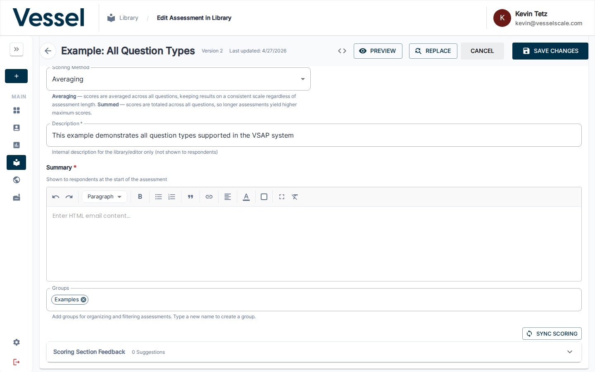
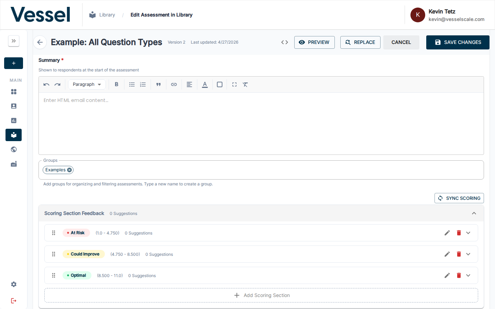
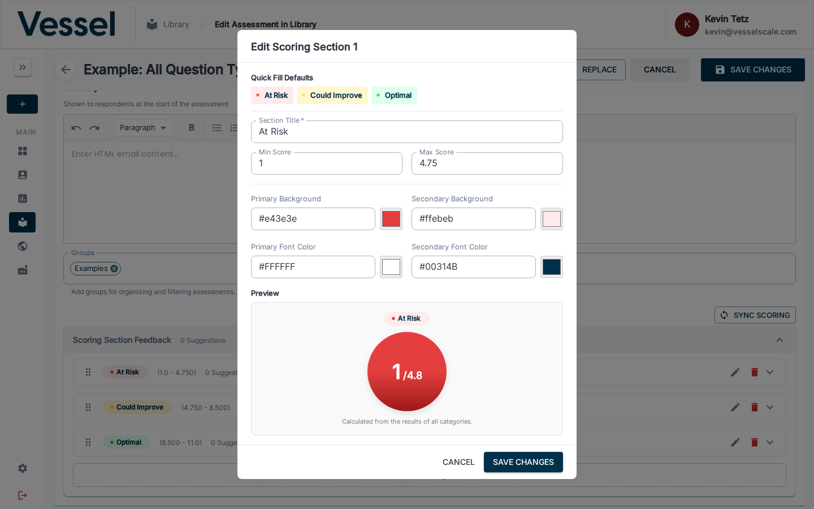
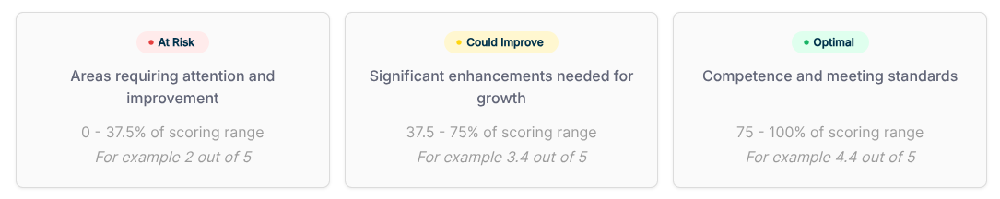

# Assessment Scoring

Assessment scores are calculated from respondent answers and displayed using one of two scoring methods — **Averaged** (the default) or **Summed**. Understanding how each method works helps you design assessments that communicate results clearly.

## How Scoring Works

When respondents complete an assessment:

1. **Question responses are scored** based on selected answers or numeric values
2. **Category scores are calculated** from all questions in that category
3. **Overall assessment score** is computed from all category scores
4. **Results are displayed** using the configured scoring method

---

## Scoring Method

The **Scoring Method** field is in the Assessment Details section of the library editor.

| Method | Description |
|--------|-------------|
| **Averaging** *(default)* | Scores are averaged across all questions, keeping results on a consistent scale regardless of assessment length |
| **Summed** | Scores are totaled across all questions, so longer assessments yield higher maximum scores |

---

### Averaged Scoring *(Default)*

With Averaging, every question's score contributes equally, and the final result stays within the same range regardless of how many questions are in the assessment.

$$\text{Averaged Score} = \frac{\text{Sum of All Question Scores}}{\text{Number of Questions}}$$

#### Key Characteristics

- **Consistent scale**: Score range stays the same no matter how many questions the assessment has
- **Easy comparison**: Assessments with different lengths can be compared directly
- **Intuitive**: A score of 4.2 means the same thing across all assessments

#### Example: Averaged Scoring

**Assessment with 10 questions, each worth 0–5 points**

| Item | Value |
|------|-------|
| Total score earned | 35 points |
| Number of questions | 10 |
| **Averaged score** | **35 ÷ 10 = 3.5** |

**Comparing two assessments of different lengths:**

| Assessment | Score Earned | Questions | Averaged Score |
|-----------|-------------|-----------|----------------|
| Assessment A | 20 pts | 5 questions | 4.0 |
| Assessment B | 40 pts | 10 questions | 4.0 |

Both show **4.0** — directly comparable despite different lengths.

---

### Summed Scoring

With Summed scoring, every question's score is added together. The maximum possible score scales with the number of questions.

$$\text{Summed Score} = \sum \text{All Question Scores}$$

#### Key Characteristics

- **Raw total**: Shows the actual accumulated points across all questions
- **Length-dependent**: Maximum score varies based on number of questions
- **Detailed analysis**: Useful when absolute point totals are meaningful

#### Example: Summed Scoring

**Assessment with 10 questions, each worth 0–5 points**

| Item | Value |
|------|-------|
| Total possible score | 50 points |
| Score earned | 35 points |
| **Summed score** | **35 out of 50** |

**Comparing two assessments of different lengths:**

| Assessment | Score Earned | Max Possible | Summed Score |
|-----------|-------------|-------------|--------------|
| Assessment A | 20 pts | 25 pts | 20/25 |
| Assessment B | 40 pts | 50 pts | 40/50 |

The raw totals differ — you must account for different maximums when comparing.

---

### Choosing the Right Method

| Use Case | Recommended Method |
|----------|-------------------|
| Comparing across assessments of different lengths | **Averaged** |
| Standard benchmarking or industry comparisons | **Averaged** |
| Point-accumulation models (longer = more points) | **Summed** |
| When absolute totals matter to your analysis | **Summed** |

!!! tip "When in doubt, use Averaging"
    Averaging is the default for good reason — it keeps scores consistent and comparable regardless of how you grow or change your assessment over time.

---

## Scoring Section Feedback

The **Scoring Section Feedback** accordion in Assessment Details lets you define named score ranges (sections) that appear on the respondent's results page with tailored feedback.

Each section defines:

- **Section name** (e.g., At Risk, Could Improve, Optimal)
- **Score range** (Min Score – Max Score)
- **Color theme** for the results display
- **Suggestions** (strengths, root causes, solutions, recommended actions)

---

### Sync Scoring

**SYNC SCORING** automatically recalculates and evenly distributes the score range thresholds across all of your scoring sections based on the current assessment configuration.

Use it whenever you:

- Add or remove questions that change the total possible score
- Add or remove scoring sections
- Change the Scoring Method between Averaged and Summed
- Want to reset thresholds to an even distribution after manual edits

!!! tip
    Always click **SYNC SCORING** after making structural changes to your assessment (adding categories, questions, or sections) to keep thresholds accurate.

---

### Editing a Scoring Section

Click the **pencil icon** (✏) on any scoring section row to open the section editor.

The editor includes:

| Field | Description |
|-------|-------------|
| **Section Title** | Name displayed on the results page (e.g., "At Risk") |
| **Min Score** | Lower bound of this score range |
| **Max Score** | Upper bound of this score range |
| **Primary Background** | Background color for the section badge |
| **Secondary Background** | Background color for score detail areas |
| **Primary Font Color** | Text color on the badge |
| **Secondary Font Color** | Text color on score detail areas |
| **Preview** | Live visualization showing how the section will appear to respondents |

Use **Quick Fill Defaults** at the top of the modal to instantly apply the standard At Risk / Could Improve / Optimal color presets.

---

## How Scores Are Calculated

### Step 1: Question Scoring

Each question is scored based on the respondent's answer:

**Multiple Choice & Multiple Select**
- Selected option's score value is assigned
- Example: Select "Strongly Agree" (score=5) on a Likert question

**Numeric Questions**
- The numeric value entered is the score
- Example: Enter "85" for "What percent of orders are on-time?"

**Numeric Range Questions**
- The numeric value is matched to a range, and that range's score is assigned
- Example: Enter "10" employees → matched to "1-20" range → score of 2

**Text Questions**
- Text questions are not scored (score = 0)
- Used for qualitative feedback only

### Step 2: Category Scoring

All question scores within a category are summed:

$$\text{Category Score} = \sum \text{All Question Scores in Category}$$

### Step 3: Overall Assessment Score

Depending on the Scoring Method:

**Averaged:**

$$\text{Overall Score} = \frac{\sum \text{All Category Scores}}{\text{Total Number of Scorable Questions}}$$

**Summed:**

$$\text{Overall Score} = \sum \text{All Category Scores}$$

---

## Normalized Scoring (Percentile Ranges)

Normalized scoring converts raw assessment scores into percentiles, displaying results as a percentage of the available score range (0–100%). This approach makes scores intuitive and comparable, regardless of the underlying assessment structure.

### What is Normalized Scoring?

Normalized scoring expresses a respondent's score as a **percentage of the maximum possible score**:

$$\text{Normalized Score (\%)} = \frac{\text{Actual Score} - \text{Min Possible Score}}{\text{Max Possible Score} - \text{Min Possible Score}} \times 100$$

This converts any score into a 0–100 percentile range, making interpretation consistent across all assessments.

#### Example: Normalized Score Calculation

**Scenario:** Assessment with min score 0, max score 50, respondent scores 37.5

$$\text{Normalized Score} = \frac{37.5 - 0}{50 - 0} \times 100 = \frac{37.5}{50} \times 100 = 75\%$$

A respondent who scores 37.5 out of 50 gets a **75% normalized score** — placing them in the upper performance tier.

### Percentile Score Ranges

Normalized scores are typically divided into **three to five performance tiers**. The standard configuration uses three tiers:

| Tier | Range | Interpretation |
|------|-------|-----------------|
| **At Risk** | 0–37.5% | Areas requiring attention and improvement |
| **Could Improve** | 37.5–75% | Significant enhancements needed for growth |
| **Optimal** | 75–100% | Competence and meeting standards |

### How Normalized Scores Map to Scoring Sections

When you define **Scoring Section Feedback** in your assessment, the platform automatically maps respondent scores to these percentile ranges:

1. **Raw score is calculated** from respondent answers (using your Averaged or Summed method)
2. **Score is normalized** to a 0–100 percentile using the min/max score range
3. **Percentile is matched** to a scoring section tier (At Risk, Could Improve, Optimal, etc.)
4. **Feedback is displayed** with the corresponding tier name, color, and suggestions

#### Example: End-to-End Scoring Flow

| Step | Calculation | Result |
|------|-------------|--------|
| **1. Raw score** | Questions scored and summed | 34 out of 50 points |
| **2. Normalize** | (34 - 0) / (50 - 0) × 100 | **68% percentile** |
| **3. Tier match** | 68% falls in 37.5–75% range | Matches **"Could Improve"** section |
| **4. Display** | Show "Could Improve" feedback with yellow color | Respondent sees recommendations for growth |

### Key Advantages of Normalized Scoring

- **Consistent interpretation**: A 75% score means the same thing across all assessments
- **Easy comparison**: Compare respondents or assessments even with different lengths
- **Intuitive results**: Percentages are universally understood (0% = lowest, 100% = highest)
- **Flexible tier definitions**: You can customize tier ranges and names to match your assessment goals
- **Color-coded feedback**: Each tier has its own color and feedback content for visual clarity

### Customizing Percentile Ranges

You can customize the tier ranges and names to fit your assessment. Common alternatives to the standard three-tier system include:

**Four-tier system:**
- Below Expectations: 0–25%
- Developing: 25–50%
- Proficient: 50–75%
- Advanced: 75–100%

**Five-tier system:**
- Critical: 0–20%
- Below Target: 20–40%
- Target: 40–60%
- Above Target: 60–80%
- Excellent: 80–100%

To customize ranges, edit each **Scoring Section** in Assessment Details and set the Min Score and Max Score to define where each tier begins and ends.

### Common Scenarios

**Scenario 1: Different Assessment Lengths, Same Score Meaning**

| Assessment | Score Earned | Max Possible | Normalized | Tier |
|-----------|-------------|-------------|-----------|------|
| Quick Survey (5 questions) | 3.75 | 5 | 75% | Optimal |
| Full Assessment (20 questions) | 15 | 20 | 75% | Optimal |

Both respondents show **75% — Optimal performance** — even though the raw scores differ.

**Scenario 2: Tracking Progress Over Time**

A respondent completes an assessment and scores 60% (Could Improve). After training, they retake the assessment and score 82% (Optimal). The normalized percentiles make progress immediately clear.

---

## Related

- [Question Types](question-types.md)
- [Create Assessment Definition](create.md)
- [Edit Assessment Definition](edit.md)
