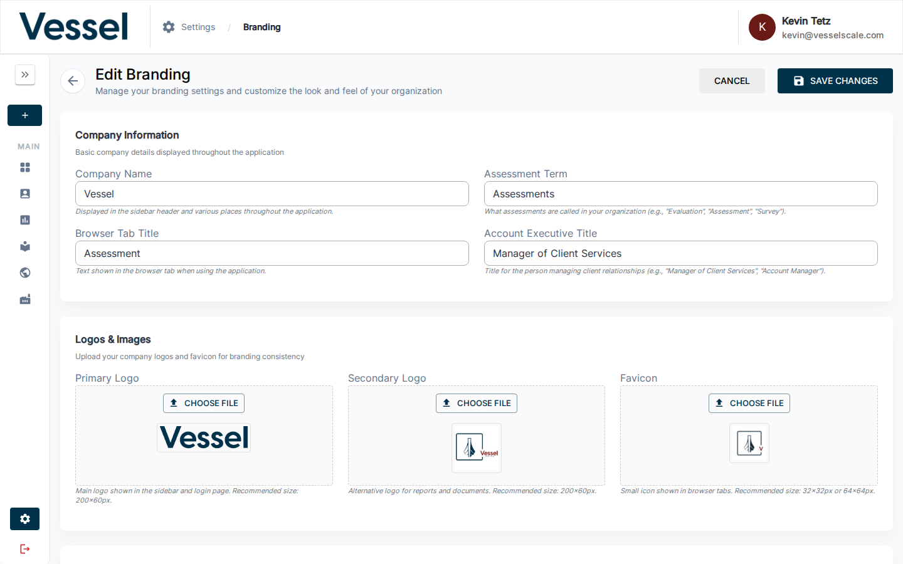

# Branding

Customize the visual identity, colors, logos, and terminology for your platform instance. These settings appear throughout the application and affect how your organization is represented to all users.

## Overview

Navigate to **Settings → Branding** to configure:

- **Organization identity** — Company name, logos, and browser tab appearance
- **Color scheme** — Primary and secondary brand colors
- **Login page** — Custom headline and description text
- **Terminology** — Business terms used throughout the app (e.g., "Assessments" vs "Evaluations")
- **Report builder** — Custom names and descriptions for report sections
- **Business rules** — Employee count thresholds for company size classification

Changes take effect immediately after saving (the page will reload automatically).

---

## Organization Identity

### Company Name

The name displayed in the header sidebar and throughout the application. Leave blank to use platform defaults.

### Primary Logo

Your organization's main logo, displayed in:
- Header/sidebar
- Login page
- Navigation bars
- Assessment pages

**Recommended size:** 200×60 pixels  
**Supported formats:** PNG, JPG, GIF, WebP

### Secondary Logo

An alternative logo used in:
- Reports and document exports
- Email templates (where appropriate)

**Recommended size:** 200×60 pixels

### Favicon

The small icon displayed in browser tabs.

**Recommended size:** 32×32 or 64×64 pixels

### Browser Tab Title

The text shown in the browser tab when users view the application. If not set, defaults to "Smart Assessment Platform".

---

## Colors

### Primary Color

Your brand's main color, used for:
- Active navigation indicators (underlines, borders)
- Accent elements throughout the interface
- Links and interactive highlights

**Format:** Hex color code (e.g., `#1976d2`)

### Secondary Color

An accent color for alternative states and emphasis. Used in:
- Secondary buttons
- Alternative highlights
- Contrast elements

**Format:** Hex color code (e.g., `#dc004e`)

---

## Header & Navigation

### Header Bar Color

Customize the background color of the top navigation bar.

**Use case:** Align the header with your brand colors or dark theme preferences.

**Format:** Hex color code (e.g., `#1e293b` for dark blue, `#ffffff` for white)

**Default:** White (`#ffffff`)

**Features:**
- Use the color picker to select a custom color
- Hex input field for precise color codes
- Predefined color swatches for quick selection

!!! tip
    When using a dark header background, the breadcrumb and profile text theme (below) can be set to LIGHT to ensure sufficient contrast and readability.

### Breadcrumb & Profile Text Theme

Control the color of navigation breadcrumbs and profile text in the header to ensure optimal contrast with your header background.

**Options:**
- **DARK** — Use dark text/breadcrumbs (recommended for light header backgrounds)
- **LIGHT** — Use light text/breadcrumbs (recommended for dark header backgrounds)

**Default:** DARK

**Affected elements:**
- Breadcrumb navigation (shows current page location)
- Profile menu text and avatar area
- Active/inactive breadcrumb indicators

**Color values:**

| Mode | Active | Inactive | Separator |
|------|--------|----------|-----------|
| **DARK** | #1e293b | #64748b | #cbd5e1 |
| **LIGHT** | #ffffff | rgba(255,255,255,0.72) | rgba(255,255,255,0.48) |

!!! example "Example: Dark Theme Setup"
    - Header Bar Color: `#1e293b` (dark blue-gray)
    - Breadcrumb & Profile Text Theme: LIGHT
    
    This creates a modern dark header with light text for high contrast.

---

## Login Page Customization

### Login Headline

Main headline displayed above the login form. Add a welcome message or organization name.

**Example:** "Welcome to the Smart Assessment Platform"

### Login Paragraph

Description or supporting text displayed below the headline. Provide context about the platform or your organization.

**Example:** "Sign in to access assessments, reports, and performance insights."

---

## Terminology

Customize business terms used throughout the application to match your organization's language.

### Assessment Property Name

What the platform calls assessments. Default: **"Assessment"**

This term appears in:
- Navigation menus
- Page titles
- Help text
- Report headings

**Examples:** "Assessment", "Evaluation", "Review", "Survey"

### Account Executive Name

The title for administrators managing client accounts. Default: **"Manager of Client Services"**

This term appears when displaying contact information and in admin descriptions.

**Examples:** "Account Manager", "Client Advisor", "Project Manager"

---

## Report Builder Customization

When users build custom reports in the Report Builder, they work with sections organized by category. You can customize the names and descriptions of these sections.

### Category Tab Names

| Default | Use Case |
|---------|----------|
| Strengths | Positive findings and capabilities |
| Gaps, Challenges, & Threats | Areas for improvement |
| Root Causes | Underlying reasons for challenges |
| Solutions | Proposed approaches to address gaps |
| Recommended Actions | Specific next steps and recommendations |
| Qualitative Insights | AI-generated summary of open-ended responses, editable by the report author |

**To customize:** Enter your preferred term or phrase for each category tab. The name you set here appears in both the Report Builder editor and in published Web Reports.

### Category Tab Descriptions

Short help text displayed under each tab name in the Report Builder. These guide users on what content belongs in each section.

**Examples:**

- **Strengths** (default): "Highlight the team strengths for future success."
- **Gaps, Challenges, & Threats** (default): "Identify areas where team goals aren't met, cite specific opportunities, or discuss external risks."
- **Root Causes** (default): "Explain the underlying reasons for the challenges identified above."
- **Qualitative Insights** (default): "Summary of responses to open-ended questions in this category. Edit as needed."

**To customize:** Provide a brief, action-oriented description for each section.

!!! note "Qualitative Insights"
    The **Qualitative Insights** tab is populated automatically from AI-generated summaries of respondents' open-ended answers. The tab name and description you set here appear both in the Report Builder editor (as help text) and in published Web Reports (as the accordion section label).

---

## Business Rules

### Company Size Thresholds

Define the employee count boundaries used to classify companies as Small, Medium, or Large.

| Setting | Default | Purpose |
|---------|---------|---------|
| **Small Company Threshold** | 50 employees | Upper limit for "Small" classification |
| **Medium Company Threshold** | 250 employees | Upper limit for "Medium" classification |

**How it works:**
- Companies with ≤ 50 employees are classified as "Small"
- Companies with 51–250 employees are classified as "Medium"
- Companies with > 250 employees are classified as "Large"

**Impact:** Used in company size displays, filtering, and data aggregation throughout the platform.

---

## Tips & Best Practices

- **Logo dimensions** — Upload logos in the recommended sizes to avoid distortion. The platform will handle responsive scaling.
- **Color contrast** — Ensure your primary color has sufficient contrast for readability, especially for accessibility.
- **Terminology consistency** — Choose terminology that aligns with how your organization refers to assessments internally.
- **Report builder sections** — Write descriptions that clearly explain to users what content should go in each report section.
- **Page reload** — After saving branding changes, the page will reload automatically to reflect the updates.
- **Testing** — After making changes, verify the appearance in different browsers and on mobile devices.

---

## Related

- [Settings](index.md)
- [Email Templates](email-templates.md)
- [Intake Forms](intake-forms.md)
- [Custom Data](custom-data.md)
