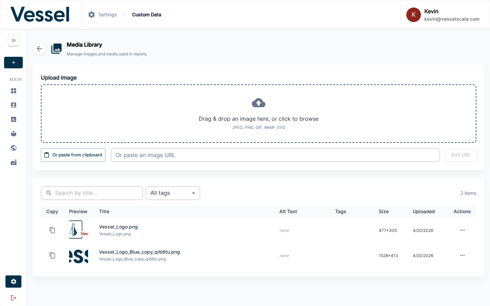
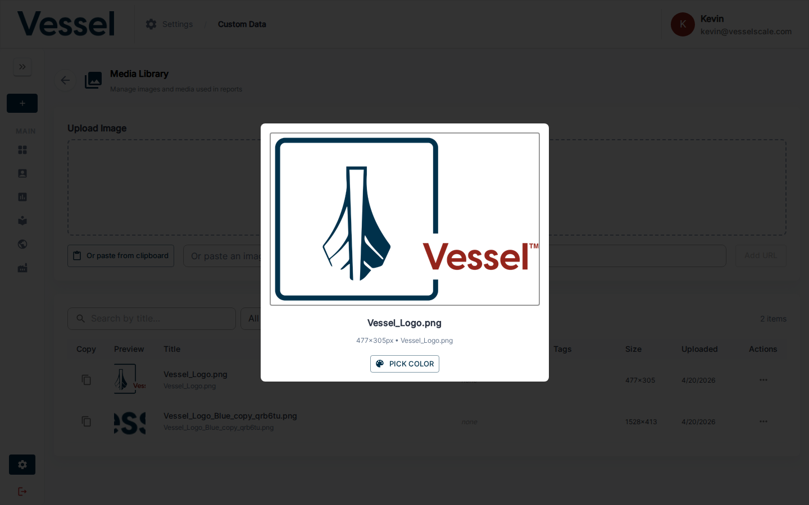
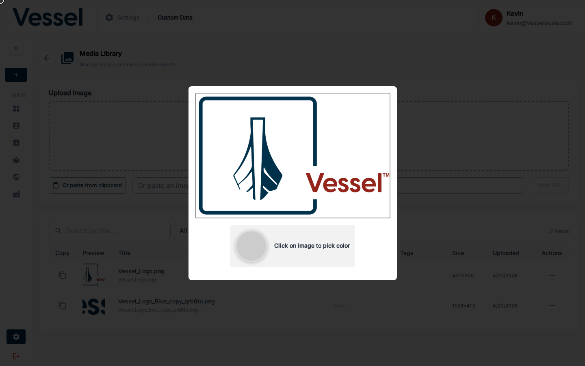

# Media Library

Store and manage images and other media assets used across your reports, web content, and branding. Media uploaded here can be referenced in web reports, email templates, and custom content blocks.

## Overview

The Media Library serves as a central repository for all images and visual assets your organization uses. Once uploaded, these assets can be easily inserted into reports, emails, and other content without needing to manage file URLs or locations.

## Uploading Media

You can upload media files using any of these methods:

### 1. Drag & Drop

Simply drag image files from your computer and drop them into the upload zone. A visual highlight appears to indicate the drop target is active.

### 2. Click to Browse

Click the upload area to open your file browser and select files from your computer.

### 3. Paste from URL

If you have an image hosted online, paste its URL directly into the URL input field. The system will fetch and store the image.

### 4. Clipboard Paste

Copy an image to your clipboard (e.g., from a screenshot or image editor) and paste it directly into the platform.

## Supported File Formats

The following image formats are supported:

- **JPEG** - Standard compressed format
- **PNG** - Supports transparency
- **GIF** - Animated or static
- **WebP** - Modern compressed format
- **SVG** - Vector graphics (scalable)

## Media Fields

When you upload or edit a media item, you can customize these fields:

| Field | Type | Description | Example |
|---|---|---|---|
| **Title** | Text | Custom name for the media asset | "Company Logo" |
| **Alt Text** | Text | Accessibility text describing the image | "Vessel Impact company logo" |
| **Description** | Text | Longer description of the image content and purpose | "High-resolution logo for web reports" |
| **Tags** | Multiple Selection | Categorize media by type or usage | "logo", "header", "footer" |
| **File Type** | Auto-detected | Image format (JPEG, PNG, etc.) | "image/png" |
| **File Size** | Auto-detected | Size in bytes | "245 KB" |
| **Dimensions** | Auto-detected | Width × Height in pixels | "1920 × 1080" |

## Image Preview & Metadata

### Preview Dialog

When you click on any media item, a preview dialog appears showing:

- Full-resolution image preview
- Current metadata (title, alt text, description, tags)
- Edit button to modify the metadata
- File information (type, size, dimensions, upload date)

### Color Picker Functionality

The image preview dialog includes an **interactive color picker** overlay that lets you:

- **Click anywhere on the image** to extract a color at that location
- **View the hex code** of the selected color (e.g., "#FF5733")
- **Copy the color code** for use in design systems or reports

#### Why Color Picker is Useful

- **Brand Consistency** - Extract exact colors from your logo or brand materials for use in report templates and web reports
- **Themed Reporting** - Match report color schemes to brand images
- **Design Planning** - Use extracted colors for section headers, backgrounds, and accent elements in web reports
- **Color Documentation** - Create a reference guide of your brand's color palette from existing assets
- **Quick Design Reference** - No need to use separate color picker tools; extract colors directly from uploaded images

## Where Media is Used

Media uploaded to the library can be referenced in:

- **[Web Reports](../web-reports.md)** - Insert images into report templates and content sections
- **[Email Templates](../email-templates.md)** - Add logos and images to email content
- **Report Sections** - Use as headers, backgrounds, or content illustrations
- **Branding** - Include in your organization's visual presentation
- **Content Blocks** - Add to custom content sections within assessments

## Related

- [Custom Data](index.md) - Custom data overview
- [Settings](../index.md) - Settings overview
- [Web Reports](../web-reports.md) - Uses media in report templates
