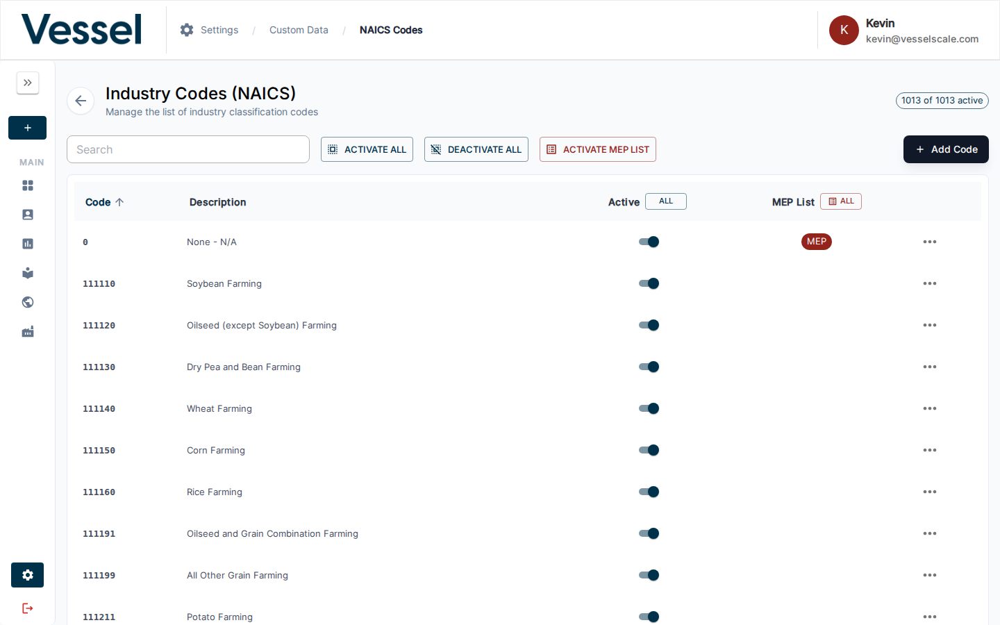
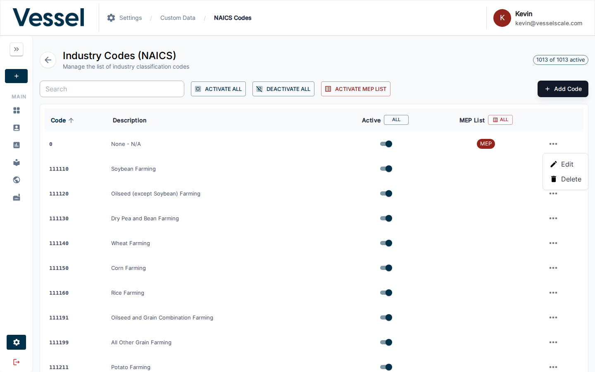

# NAICS Codes

NAICS (North American Industry Classification System) codes categorize business industries. This section allows you to customize which industry codes are available in your ecosystem.

## Overview

NAICS codes are six-digit classifications used to identify business types and industries. By managing which codes are active and visible in your system, you can tailor the platform to your specific ecosystem and industry focus.

## Available Filters & Settings

When managing NAICS codes, you can use the following controls:

| Filter/Setting | Description | Use Case |
|---|---|---|
| **Search Box** | Search by code number or description | Find specific industries quickly (e.g., "336111" or "automobile") |
| **Active Status Toggle** | Show/hide inactive codes | Maintain a curated list while keeping historical data |
| **MEP List Flag** | Identify codes associated with manufacturing sectors | Filter codes relevant to Manufacturing Extension Partnership (MEP) programs |
| **Bulk Actions** | Select multiple codes at once | Activate/deactivate groups of related industries; set MEP flags for multiple codes |
| **Sort Controls** | Sort by code, description, or status | Organize codes by any column |

## NAICS Code Fields

Each NAICS code record contains:

- **Code**: Six-digit industry classification code (e.g., "336111")
- **Description**: Human-readable industry name (e.g., "Automobile Manufacturing")
- **Active Status**: Whether this code is available for selection in forms and assessments
- **MEP List Flag**: Whether this code qualifies for MEP manufacturing programs

## Where NAICS Codes Are Used

NAICS codes appear throughout the platform:

- **[Intake Forms](../intake-forms.md)** - Industry Type page where users select their business classification
- **[Web Reports](../web-reports.md)** - Dynamically populate assessment content based on selected industry
- **[Industries](../../industries/index.md)** - Reference data for ecosystem analysis and reporting
- **[Dashboard Pivots](../../dashboard/pivot-table.md)** - Group and analyze accounts by industry classification
- **Account Details** - Display associated NAICS codes for filtering and segmentation

## Related

- [Custom Data](index.md) - Custom data overview
- [Settings](../index.md) - Settings overview
