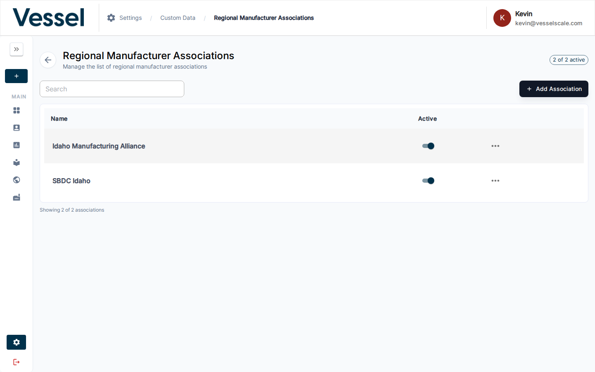
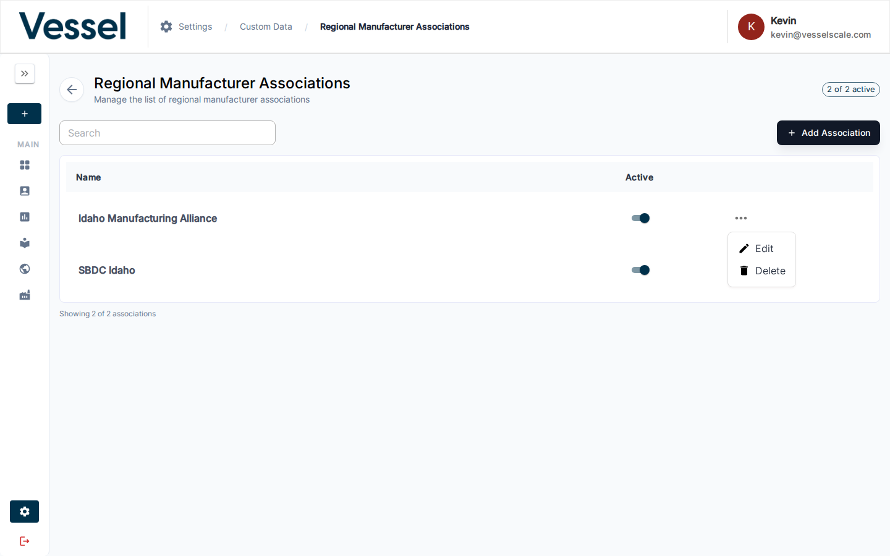

# Regional Manufacturer Associations (RMA)

RMAs are regional organizations that support manufacturing businesses. This section lets you define which associations are relevant to your ecosystem.

## Overview

Regional Manufacturer Associations connect businesses with local resources, training, and support. By managing RMAs in your system, you can help organizations identify and connect with relevant support networks in their region.

## Available Filters & Settings

When managing RMAs, you can use the following controls:

| Filter/Setting | Description | Use Case |
|---|---|---|
| **Search Box** | Search by association name | Find specific RMAs quickly |
| **Active Status Toggle** | Show/hide inactive associations | Maintain a curated list while preserving historical data |
| **Sort Controls** | Sort by name or status | Organize associations alphabetically or by status |
| **Bulk Actions** | Select multiple associations | Update active status for groups of RMAs |

## RMA Fields

Each RMA record contains:

- **Name**: Organization name (e.g., "Northeast Manufacturing Association")
- **Active Status**: Whether this RMA is available for selection in forms and accounts

## Where RMAs Are Used

RMAs are referenced throughout the platform:

- **[Intake Forms](../intake-forms.md)** - Regional Associations page where users select their local association
- **Account Details** - Associate accounts with specific RMAs for ecosystem mapping
- **Dashboard Pivots** - Group and analyze accounts by regional association
- **Ecosystem Analysis** - Understand geographic distribution and regional support structures

## Related

- [Custom Data](index.md) - Custom data overview
- [Settings](../index.md) - Settings overview
