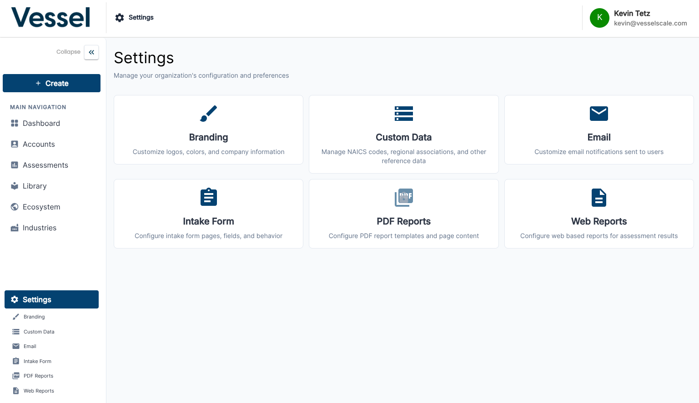

# Settings

The Settings section allows administrators to configure platform-wide options for their organization.

## Available Settings

- [Branding](branding.md) — customize logos, colors, and terminology
- [Custom Data](custom-data.md) — manage NAICS codes and Regional Manufacturer Associations

## Settings Overview

The Settings page provides a centralized location for managing your platform configuration. From here, administrators can access all available settings, configure branding to match your organization's identity, manage custom data collections, and control platform features. The settings interface is designed to be intuitive while providing powerful customization options for enterprise deployments.

## Access

Settings are only available to users with the **admin** role and require the Settings feature flag to be enabled for your account.

## Related

- [Branding](branding.md)
- [Custom Data](custom-data.md)
