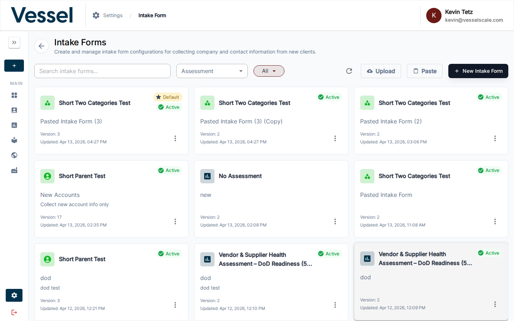
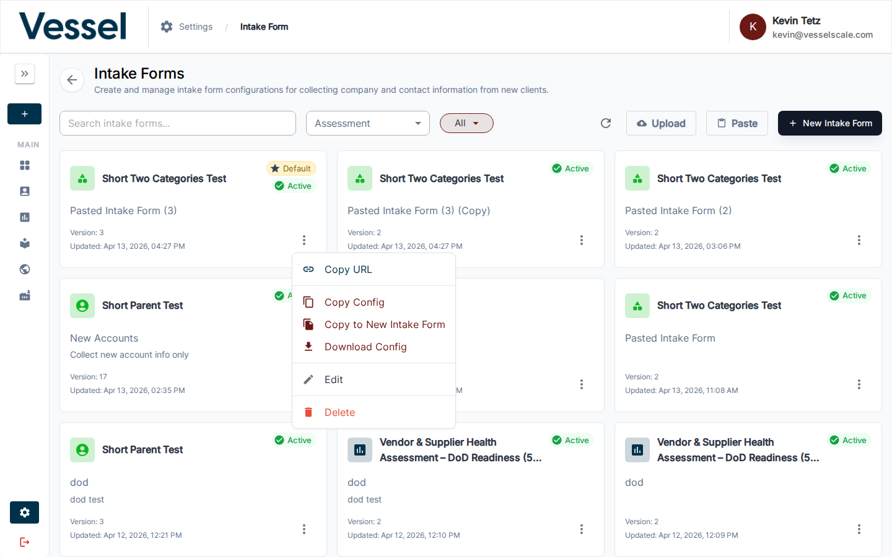
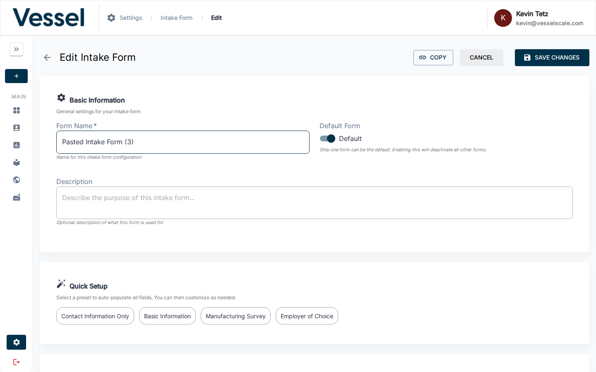

---
tags:
  - settings
  - intake-forms
  - admin
  - public-forms
  - create
  - assessments
  - accounts
---

# Intake Forms

Intake forms are publicly accessible forms that collect company and contact information from prospective clients. When a visitor submits an intake form, their data is saved to the platform as an Account and Contact — and optionally, an Assessment is automatically created for them.

## Overview

Each intake form is a **configuration** that controls:

- Which **pages** appear in the form (company lookup, contact info, county, industry, etc.)
- Whether an **assessment is automatically created** upon submission
- Which **contact fields** are required
- Custom **branding** for the landing and methodology intro pages
- Whether an **email notification** is sent upon submission
- A **legal agreement** page the user must accept

The same form can be shared as a URL link and accessed by anyone without logging in. Multiple configurations can exist, but only one is the **default** (used when no specific `formId` is provided in the URL).

---

## Managing Intake Forms

Navigate to **Settings → Intake Forms** to view all configurations.



### The List View

Each intake form appears as a card showing:

- **Assessment icon and name** — the assessment definition linked to this form, or "No Assessment" if the form is data-collection only
- **Form name** — the internal name you gave the configuration
- **Description** — optional short description
- **Active badge** — shown when this form is the default
- **Version** — increments automatically on every save
- **Updated date** — when the configuration was last changed

Cards are sorted by most recently updated. Click any card to open the editor.

### Filtering

| Control | Purpose |
|---------|---------|
| **Search box** | Filter by form name or description |
| **Assessment dropdown** | Show only forms linked to a specific assessment definition |
| **All / Default / Not Default chip** | Filter by whether the form is the active default |

### Actions Menu



Click the three-dot (**⋮**) menu on any card to access:

| Action | Description |
|--------|-------------|
| **Copy URL** | Copies the public intake form URL to clipboard: `{origin}/intake-form?formId={uuid}` |
| **Copy Config** | Copies the raw JSON configuration to clipboard |
| **Copy to New Intake Form** | Duplicates the form as a new inactive configuration named `{name} (Copy)` |
| **Download Config** | Downloads the config as a `.json` file |
| **Edit** | Opens the configuration editor |
| **Delete** | Permanently deletes the configuration (with confirmation) |

### Import Options

Two buttons allow you to create a new form from an existing configuration:

- **Upload** — Select a `.json` file from disk; creates a new configuration named `"Pasted Intake Form"` (or `"Pasted Intake Form (2)"` etc. to avoid collisions)
- **Paste** — Opens a dialog where you can paste JSON directly or read from the clipboard

These are useful for copying configurations between environments or sharing form designs with other organizations.

### Creating a New Form

Click **New Intake Form** (top right) to open the editor in create mode.

---

## Editing a Configuration

The form editor is divided into several sections. Changes are only saved when you click **Save Changes**.



### Basic Information

| Field | Description |
|-------|-------------|
| **Form Name** | Internal label used in the list view. Required. |
| **Description** | Optional short description for internal reference |
| **Default Form** | Toggle to make this the active default. Only one form can be default at a time — enabling this automatically deactivates any other active form. |

### Quick Setup (Presets)

Click a preset button to auto-populate all settings at once. You can then customize any section afterward. Available presets:

| Preset | Pages Included | Assessment Created |
|--------|---------------|-------------------|
| **Contact Information Only** | Company Selection, Contact Form | No |
| **Basic Information** | Company Selection, Contact Form, Company Size, Industry Type | No |
| **Manufacturing Survey** | Company Selection, Contact Form, County Selection, Company Size, Industry Type, Regional Associations | No |
| **Employer of Choice** | Company Selection, Contact Form, County Selection, Company Size, Industry Type, Regional Associations, Legal Agreement | Yes (requires assessment selection) |

### Behavior Settings


| Setting | Description |
|---------|-------------|
| **Show Landing Page** | Show an intro/landing page before the form begins. Enables the Landing Page Branding section. |
| **Show Methodology Page** | Show a methodology/explanation page before the form. Enables the Methodology Branding section. |
| **Show Thank You Page** | Show a confirmation page after submission. |
| **Create Assessment** | When enabled, automatically creates an assessment upon form submission. Enables the Assessment Configuration section. |
| **Keep Collecting After Target** | When an assessment is created, keep the parent assessment open even after its response target is reached. |

### Assessment Configuration

Visible only when **Create Assessment** is enabled.

**Parent Assessment** — Select the assessment definition to create. When you pick a parent that has child assessments, the children are automatically included and listed below with their own target response fields.

**Target Responses** — The number of submissions before the assessment is considered complete.

**Child Assessments** — Listed automatically from the parent definition. Each child can have its own target response count (defaults to the parent's target).

**Assessment Name Template** — Controls how the created assessment is named. The default is `{{account_name}} {{assessment_name}}`. Available template variables:

| Variable | Description | Example |
|----------|-------------|---------|
| `{{account_name}}` | The submitting company's name | Acme Manufacturing |
| `{{assessment_name}}` | The assessment definition name | Employer of Choice |
| `{{current_year}}` | Four-digit year at time of submission | 2026 |
| `{{current_date}}` | Full date at time of submission | April 21, 2026 |

### Page Configuration


Select which pages appear in the intake form. **Company Selection** and **Contact Form** are always required and cannot be removed.

| Page | What it does |
|------|-------------|
| **Company Selection** | Lets users search for an existing company or create a new one. Always included. |
| **Contact Form** | Collects name, email, and other contact details. Always included. |
| **County Selection** | Asks the user to select their county. Automatically makes **State** a required contact field when enabled. |
| **Company Size** | Asks the user to specify their company's employee count range. |
| **Industry Type** | Asks the user to select NAICS industry codes. |
| **Regional Associations** | Asks the user to select regional manufacturing associations they belong to. |
| **Additional Information** | Collects extended company details: secondary address, website, annual sales, government contractor/veteran/women-owned flags. |
| **Legal Agreement** | Displays a legal agreement that the user must accept before submitting. Enables the Legal Agreement editor below. |

### Required Contact Information

Select which contact form fields are required. Fields marked as "always required" (First Name, Last Name, Email Address, Company Name) cannot be changed.

| Field | Always Required | Notes |
|-------|----------------|-------|
| First Name | Yes | |
| Last Name | Yes | |
| Email Address | Yes | |
| Company Name | Yes | |
| Job Title | No | |
| Phone Number | No | |
| Street Address | No | |
| City | No | |
| State | No | Auto-required when County Selection page is enabled |
| ZIP Code | No | |

### Legal Agreement

Visible only when the **Legal Agreement** page is enabled in Page Configuration.

A rich text (HTML) editor for the legal agreement text shown to users. When you first add the Legal Agreement page, this field is pre-filled with the platform's default EULA text, which you can customize or replace entirely.

### Landing Page Branding

Visible only when **Show Landing Page** is enabled.

| Field | Description |
|-------|-------------|
| **Title** | Main headline shown on the landing page |
| **Subtitle** | Secondary text below the headline |
| **Description** | Body text paragraphs (one paragraph per line) |
| **Estimated Time** | How long the form takes, shown to users (e.g., "15–20 minutes") |

### Methodology Page Branding

Visible only when **Show Methodology Page** is enabled.

| Field | Description |
|-------|-------------|
| **Title** | Heading for the methodology page |
| **Description** | Explanatory text about the assessment approach |
| **Footer** | Closing paragraph(s) (one paragraph per line) |
| **Categories** | List of assessment focus areas, each with an icon, title, and optional percentage. Use **Auto-Populate from Assessment** to populate from the selected assessment's question categories. |

---

## The Public Intake Form URL

Every intake form has a shareable URL:

```
https://yourplatform.com/intake-form?formId={uuid}
```

- The UUID is the form's unique identifier, visible in the browser URL when editing it
- Use the **Copy URL** action from the list view to get this link quickly
- This link requires no login — anyone with the link can submit the form
- If `formId` is omitted, the platform uses the currently active default form

You can share this URL via email, embed it in a website, or use it as a landing page link.

---

## How the Default Form Works

Only one intake form can be the **default** at a time. The default form is used when:

- Someone visits `/intake-form` without a `formId` parameter
- An integration links to the intake form without specifying a particular config

Setting a form as default automatically deactivates the previously active form. The **Active** badge in the list view shows which form is currently the default.

---

## Export and Import

Configurations can be shared across environments or backed up:

1. **Export**: Use **Download Config** from the action menu to save a JSON file
2. **Import**: Use **Upload** on the list page to create a new config from a JSON file, or use **Paste** to paste the JSON directly

When importing, a new configuration is created with a generated name. You can then rename and edit it before making it the default.

---

## Email Notifications

Each form can send an email notification when a new submission is received. To configure this:

1. In the form editor, find **Email Notification** in the Behavior Settings section
2. Enable the **Email Notifications** toggle
3. Enter the email address that should receive notifications

The notification is sent to a single address. For multiple recipients, consider a distribution list.

---

## Tips

- **Versioning** — Every save increments the version number. Use descriptions to note what changed between versions.
- **Testing a form** — After creating a config, copy the URL and open it in an incognito/private browser window to experience it exactly as a new visitor would.
- **Preset + customize** — The fastest way to create a new form is to apply a preset, then make targeted adjustments.
- **Data-only forms** — Disable **Create Assessment** to use the intake form purely for data collection without triggering any assessment workflow.
- **Multiple forms** — You can have many inactive forms (e.g., for different regions or assessment types) and share their specific URLs without affecting the default form.
