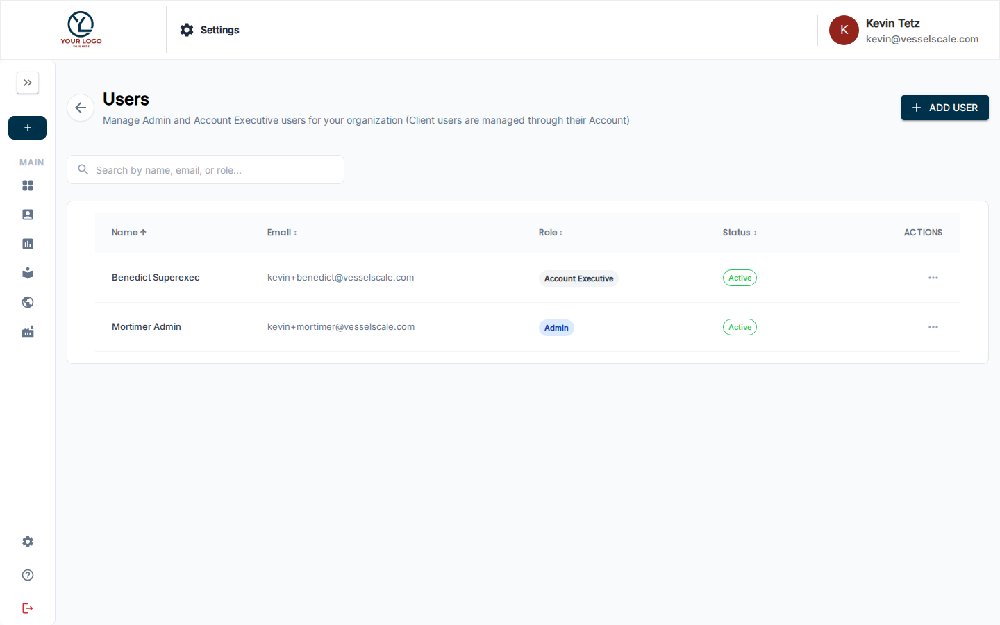

# Manage Users

The Users page allows administrators to manage all users in their organization and assign them roles across different accounts.

## Overview

From the Users page, you can:

- **View all active users** — See a list of all users with their assigned roles
- **Invite new users** — Send invitations to new team members
- **Assign roles** — Control what each user can do across different accounts
- **Manage access** — Remove users or change their role assignments

## User List

The Users list shows:

- **Name** — User's full name
- **Email** — User's email address  
- **Primary Role** — Their default role in the system
- **Accounts** — Accounts where the user has special role assignments
- **Status** — Active, invited, or inactive

## Inviting Users

### To invite a new user:

1. Click the **+ Invite Users** button
2. Enter the email address of the person you want to invite
3. Select their initial role:
   - **Admin** — Full system access and configuration
   - **Account Executive** — Multi-account management (assign specific accounts)
   - **Client** — Self-service assessment and results viewing
4. If assigning Account Executive, select which accounts they manage
5. Click **Send Invite**

The user will receive an email invitation with a link to create their account and set their password.

### Bulk invitations

You can invite multiple users at once by entering multiple email addresses separated by commas.

## Assigning Roles

### Default roles

When users are first invited, they receive a default role for the entire system. This role applies to all accounts unless overridden.

### Account-specific roles

For Account Executives, you can assign different roles for specific accounts:

1. Click the user's name to view their details
2. Under **Account Assignments**, select an account
3. Choose the role for that account
4. Click **Save**

This allows a user to be an Account Executive for one account and a Client for another.

## Related

- [Permissions & User Roles](permissions.md) — Understand what each role can do
- [Settings](index.md) — Settings overview
