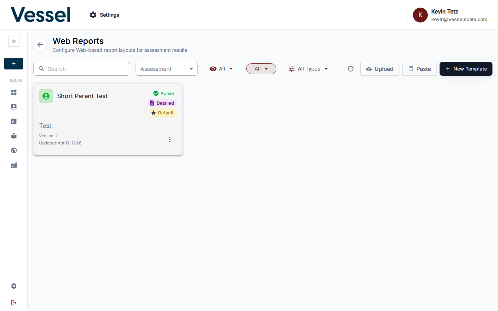
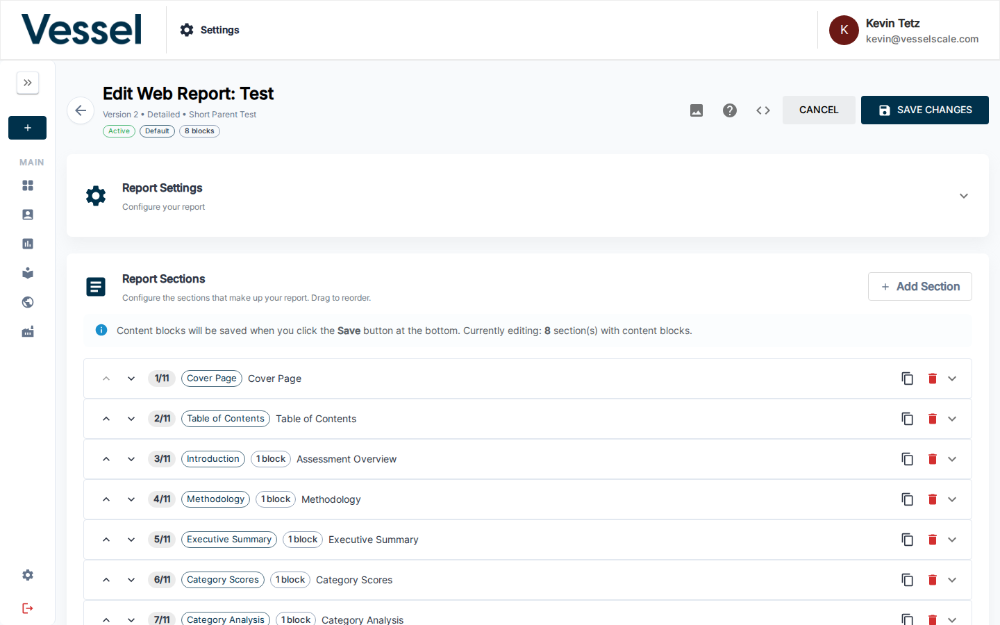

# Web Reports

Create and customize branded web-based assessment reports.

## Overview

Web Reports allow you to design professional, branded reports that are delivered online. These reports can include:
- Custom branding and styling
- Dynamic content blocks
- Assessment results and visualizations
- Conditional sections based on responses
- Custom media and images

## Key Features

- **Report Builder** - Drag-and-drop interface for creating report templates
- **Branding** - Apply your organization's colors, fonts, and logos
- **Media Management** - Upload and manage images used in reports
- **Preview & Testing** - See how reports look before publishing
- **Custom Data** - Reference industry classifications and custom data in reports

## Related Sections

- [Settings](index.md) - Settings overview
- [Custom Data](custom-data.md) - Manage reference data used in reports
- [Media Library](custom-data.md#media-library) - Upload and manage media assets
- [Branding](branding.md) - Organization branding and styling

> **Note:** For comprehensive Web Reports documentation, see the Assessment section under [Web Reports](../assessments/report-builder.md).
