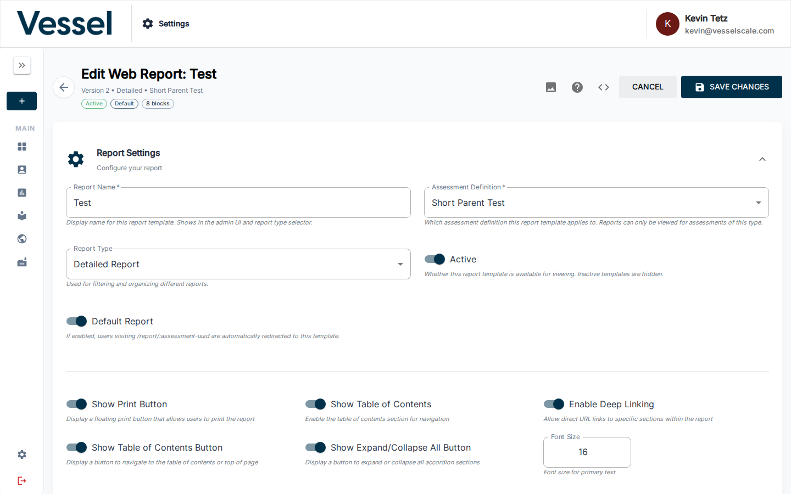
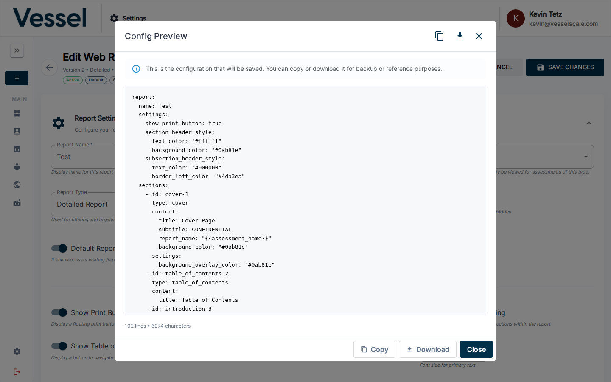

# Web Reports

Create and customize branded web-based assessment reports.

## Overview

Web Reports allow you to design professional, branded reports that are delivered online. These reports can include:
- Custom branding and styling
- Dynamic content blocks
- Assessment results and visualizations
- Conditional sections based on responses
- Custom media and images

## Template Card Actions

Each template card on the Web Reports list has a **⋮ (three-dot) actions menu** in the bottom-right corner. Click it to reveal the following options:

| Action | What it does |
|--------|-------------|
| **Copy to Clipboard** | Copies the full YAML configuration of this template to your clipboard. Useful for pasting into another environment or backing up the config. |
| **Copy to New Report** | Creates a duplicate of this template as a new **inactive** report. A confirmation dialog appears before the copy is made. The duplicate gets its own report URL. |
| **Download Config** | Downloads the template's YAML configuration as a `.yaml` file to your computer. |
| **Edit** | Opens the full report editor for this template. Equivalent to clicking anywhere on the card itself. |
| **Delete** | Permanently deletes the template. A confirmation dialog asks you to confirm before deletion. **This cannot be undone.** |

## Key Features

- **Report Builder** - Drag-and-drop interface for creating report templates
- **Branding** - Apply your organization's colors, fonts, and logos
- **Media Management** - Upload and manage images used in reports
- **Preview & Testing** - See how reports look before publishing
- **Custom Data** - Reference industry classifications and custom data in reports

## Report Settings

Each report template has configurable settings including:
- **Report Name** - Display name shown in the admin UI and report type selector
- **Assessment Definition** - Which assessment type this template applies to
- **Report Type** - Used for filtering and organizing different reports
- **Active** - Whether the template is available for viewing
- **Default Report** - If enabled, users visiting `/report/:assessment-uuid` are automatically redirected to this template
- Display options such as Show Print Button, Show Table of Contents, Show Expand/Collapse All Button, Enable Deep Linking, and Font Size

## Report Sections

Reports are composed of ordered sections (e.g., Cover Page, Table of Contents, Introduction, Methodology, Executive Summary, Category Scores). Sections can be reordered by dragging and new sections can be added with the **+ Add Section** button.

## Using the Media Library in the Editor

The Media Library drawer lets you browse your uploaded images and copy their URLs directly into image fields — without leaving the report editor.

### Opening and Closing the Drawer

Click the **Media Library** button in the editor's sticky header to toggle the drawer open. Click it again (or the **×** in the drawer) to close it. The drawer slides in alongside the editor so you can keep working.

### Copying an Image URL

1. With the drawer open, find the image you want to use.
2. Click the **Copy Link** button (chain/link icon) on the image tile.
3. The image URL is now on your clipboard.

### Pasting the URL into an Image Field

1. Inside the section or content block you're editing, locate the **Image URL** field.
2. Click into the field and paste (`Ctrl+V` / `Cmd+V`).
3. A preview of the image appears below the field to confirm the correct asset was selected.

### Enabling the Image

After pasting the URL, the image will only be visible in the rendered report once it is enabled:

- Tick the **checkbox** next to the image field (labeled something like **Show Image** or **Enable Background Image** depending on the section type).
- With the checkbox checked, the image is included when the report renders.
- Uncheck the box at any time to hide the image without removing the URL.

## Config Preview

The **Config Preview** (accessed via the `<>` button in the editor toolbar) shows the full YAML configuration that will be saved. You can copy or download the config for backup or reference purposes.

## Template Variables

Text fields in section content (titles, body text, etc.) support `{{variable}}` placeholders that are resolved server-side before the report is rendered.

| Variable | Description | Example Value |
|----------|-------------|---------------|
| `{{assessment_name}}` | Name of the assessment | Q4 2025 Manufacturing Readiness |
| `{{account_name}}` | Account/company name | Acme Manufacturing |
| `{{closed_date}}` | Formatted close date | February 15, 2026 |
| `{{total_respondents}}` | Number of respondents | 12 |
| `{{overall_score}}` | Overall assessment score | 3.42 |
| `{{max_score}}` | Maximum possible score | 5 |
| `{{min_score}}` | Minimum possible score | 1 |
| `{{normalized_score}}` | Normalized score (0–100) | 60.5 |
| `{{tenant_name}}` | Tenant/organization name | Impact Washington |
| `{{logo_url}}` | URL to the tenant branding logo | https://... |
| `{{current_date}}` | Today's date at render time | February 22, 2026 |
| `{{category_count}}` | Number of categories in the assessment | 6 |
| `{{question_count}}` | Total questions across all categories | 42 |

Unknown variables are left unchanged in the output, so use the exact names shown above. A full interactive reference is also available via the **Template Variables Reference** button in the report editor.

## Related Sections

- [Settings](index.md) - Settings overview
- [Custom Data](custom-data.md) - Manage reference data used in reports
- [Media Library](custom-data.md#media-library) - Upload and manage media assets
- [Branding](branding.md) - Organization branding and styling

> **Note:** For comprehensive Web Reports documentation, see the Assessment section under [Web Reports](../assessments/report-builder.md).
